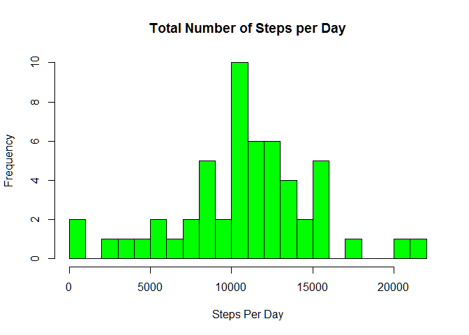
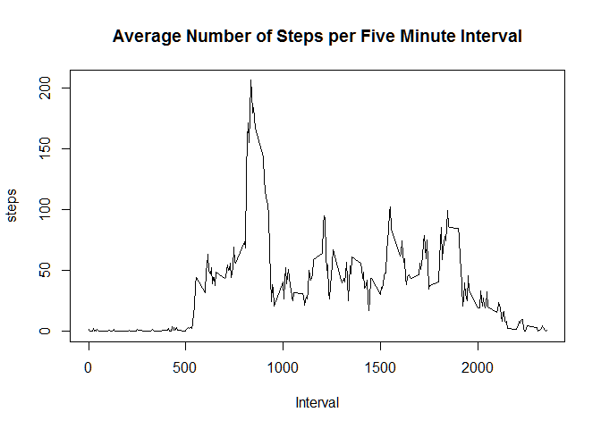
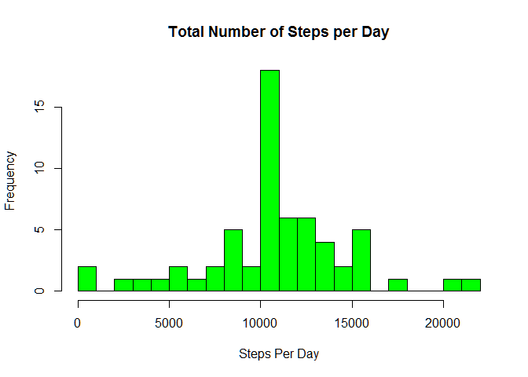
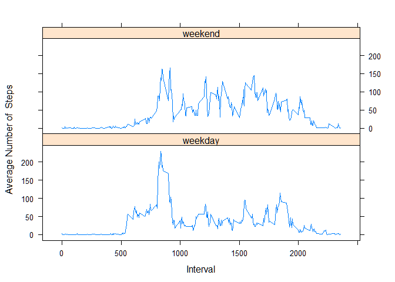

# Reproducible Research: Peer Assessment 1


## Loading and preprocessing the data

1. Load the data (i.e. `read.csv()`)


```r
  actdata<-read.csv("activity.csv")
```

2. Process/transform the data (if necessary) into a format suitable for your analysis


```r
  #Apply the date format to the date field.
  actdata$date<-as.Date(actdata$date)
```

## What is mean total number of steps taken per day?
For this part of the assignment, you can ignore the missing values in
the dataset.

1. Calculate the total number of steps taken per day


```r
  #Filter out rows that are missing data.
  actdata.complete<-actdata[complete.cases(actdata),]
  #Calculate the total steps per day on the new dataset.
  stepsperday<-aggregate(steps ~ date,data = actdata.complete, FUN = sum)
```

2. If you do not understand the difference between a histogram and a barplot, research the difference between them. Make a histogram of the total number of steps taken each day


```r
  hist(stepsperday$steps,breaks=20,col="green",xlab="Steps Per Day",main="Total Number of Steps per Day")
```



3. Calculate and report the mean and median of the total number of steps taken per day


```r
  stepmean<-mean(stepsperday$steps)
  stepmedian<-median(stepsperday$steps)
```

The **mean** of the total number of steps per day is **10,766.19**.  The **median** of the total number of steps per day is **10,765**.

## What is the average daily activity pattern?

1. Make a time series plot (i.e. `type = "l"`) of the 5-minute interval (x-axis) and the average number of steps taken, averaged across all days (y-axis)


```r
  #Calculate and average steps per interval and plot the results.
  avgstepsperint<-aggregate(steps ~ interval, data = actdata.complete, FUN = mean)
  with (avgstepsperint,plot(interval,steps,type="l",xlab="Interval",ylab="steps",
      main="Average Number of Steps per Five Minute Interval"))
```



2. Which 5-minute interval, on average across all the days in the dataset, contains the maximum number of steps?


```r
  maxsteps<-max(avgstepsperint$steps)
  maxinterval<-avgstepsperint[avgstepsperint$steps==maxsteps,"interval"]
```

Interval **835** has the highest average number of steps taken with an average of **206.1698113**.

## Imputing missing values

Note that there are a number of days/intervals where there are missing
values (coded as `NA`). The presence of missing days may introduce
bias into some calculations or summaries of the data.

1. Calculate and report the total number of missing values in the dataset (i.e. the total number of rows with `NA`s)


```r
  missingcount<-sum(is.na(actdata$steps))
  totalcount<-nrow(actdata)
```

  **2304** rows out of **17568** contain missing values.

2. Devise a strategy for filling in all of the missing values in the dataset. The strategy does not need to be sophisticated. For example, you could use the mean/median for that day, or the mean for that 5-minute interval, etc.

  I will use the mean for the five minute intervals to fill in the missing data.

3. Create a new dataset that is equal to the original dataset but with the missing data filled in.


```r
  #Merge data from avgstepsperint with actdata by the interval.
  actdata.fill<-merge(actdata,avgstepsperint,by.x="interval",by.y="interval")
  #For steps from actdata (steps.x) with missing values, replace with the value from avgstepsperint (steps.y).
  actdata.fill[is.na(actdata.fill$steps.x),"steps.x"]<-actdata.fill[is.na(actdata.fill$steps.x),"steps.y"]
  #Drop the extra column, change the column order, and change the remaining column names back to their original names.
  actdata.fill<-actdata.fill[,c(2,3,1)]
  names(actdata.fill)<-names(actdata)
```

4. Make a histogram of the total number of steps taken each day and Calculate and report the **mean** and **median** total number of steps taken per day. Do these values differ from the estimates from the first part of the assignment? What is the impact of imputing missing data on the estimates of the total daily number of steps?


```r
  stepsperday.fill<-aggregate(steps ~ date,data = actdata.fill, FUN = sum)
  hist(stepsperday.fill$steps,breaks=20,col="green",xlab="Steps Per Day",main="Total Number of Steps per Day")
```



```r
  stepmean.fill<-mean(stepsperday.fill$steps)
  stepmedian.fill<-median(stepsperday.fill$steps)
```

The **mean** is now **10,766.19** and the **median** is now **10,766.19**.  The median is now equal to the mean.

## Are there differences in activity patterns between weekdays and weekends?

For this part the `weekdays()` function may be of some help here. Use
the dataset with the filled-in missing values for this part.

1. Create a new factor variable in the dataset with two levels -- "weekday" and "weekend" indicating whether a given date is a weekday or weekend day.


```r
  #Create a vector mapping the dates of actdata.fill to "weekday" or "weekend".
  weekval<-ifelse(weekdays(actdata.fill$date) %in% c("Saturday","Sunday"),"weekend","weekday")
  #Bind the vector to accdata.fill.  R automatically treats weekval as a factor.
  actdata.week<-cbind(actdata.fill,weekval)
```

2. Make a panel plot containing a time series plot (i.e. `type = "l"`) of the 5-minute interval (x-axis) and the average number of steps taken, averaged across all weekday days or weekend days (y-axis).


```r
  library(lattice)
  #Calculate the average number of steps by the interval and weekval.
  avgstepsperint.week<-aggregate(steps ~ interval + weekval, data = actdata.week, FUN = mean)
  #Plot using the lattice package.
  xyplot(steps~interval | weekval, data = avgstepsperint.week,type = 'l', xlab = 'Interval',
         ylab = 'Average Number of  Steps', layout = c(1,2))
```


